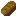

# Mineclone 2 (5) More Food mod [mcl_morefood]
This mod adds five more food items to the Mineclone 2 (5) game!

## Items
*  Sandwich
*  Chocolate bar
*  Fried egg
*  Cheese
*  Sweet Berry Pie

## Media sources
Chocolate texture from Farming Redo by TenPlus1 (slighty edited by me)
Cheese texture from Mobs Animal by Krupnov Pavel (slighty edited by me)
Fried egg texture from Mobs Animal by Krupnov pavel (slighty edited by me)
Sandwich texture uses bread texture from REFI by MysticTempest (slighty edited by me) and cooked beef palette from PixelPerfection by XSSheep
Sweet Berry Pie texture uses pumpkin pie texture from PixelPerfection by XSSsheep
